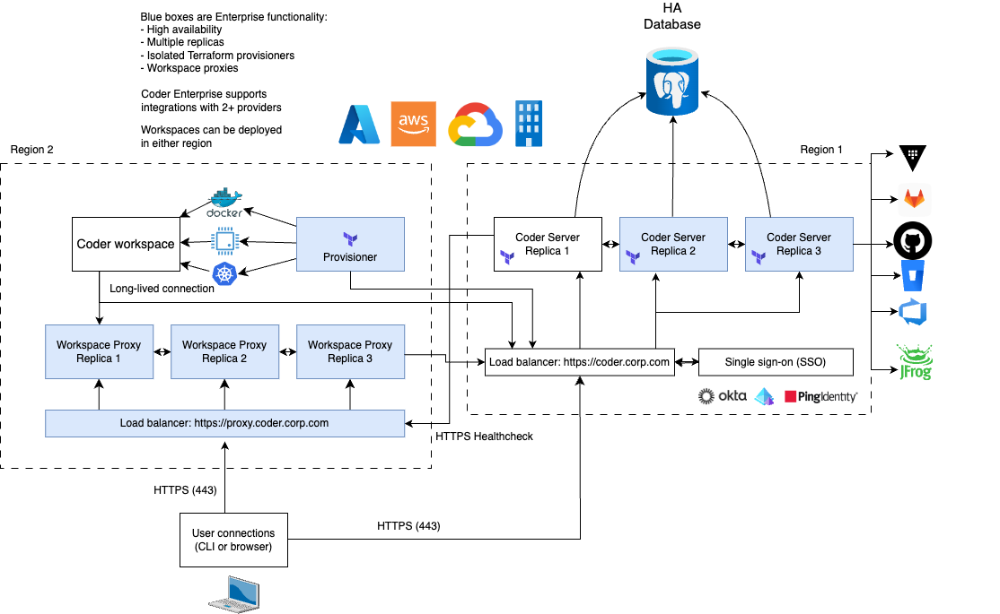

# Architecture

The Coder deployment model is flexible and offers various components that
platform administrators can deploy and scale depending on the use cases. This
page describes possible deployments, challenges, and risks associated with them.

Learn more about our [Reference Architectures](../admin/architectures/index.md)
and platform scaling capabilities.

## Components

### coderd

coderd is the service created by running `coder server`. It is a thin API that
connects workspaces, provisioners and users. coderd stores its state in Postgres
and is the only service that communicates with Postgres.

It offers:

- Dashboard (UI)
- HTTP API
- Dev URLs (HTTP reverse proxy to workspaces)
- Workspace Web Applications (e.g easily access code-server)
- Agent registration

### provisionerd

provisionerd is the execution context for infrastructure modifying providers. At
the moment, the only provider is Terraform (running `terraform`).

By default, the Coder server runs multiple provisioner daemons.
[External provisioners](../admin/provisioners.md) can be added for security or
scalability purposes.

### Agents

An agent is the Coder service that runs within a user's remote workspace. It
provides a consistent interface for coderd and clients to communicate with
workspaces regardless of operating system, architecture, or cloud.

It offers the following services along with much more:

- SSH
- Port forwarding
- Liveness checks
- `startup_script` automation

Templates are responsible for
[creating and running agents](../templates/index.md#coder-agent) within
workspaces.

### Service Bundling

While coderd and Postgres can be orchestrated independently, our default
installation paths bundle them all together into one system service. It's
perfectly fine to run a production deployment this way, but there are certain
situations that necessitate decomposition:

- Reducing global client latency (distribute coderd and centralize database)
- Achieving greater availability and efficiency (horizontally scale individual
  services)

### Workspaces

At the highest level, a workspace is a set of cloud resources. These resources
can be VMs, Kubernetes clusters, storage buckets, or whatever else Terraform
lets you dream up.

The resources that run the agent are described as _computational resources_,
while those that don't are called _peripheral resources_.

Each resource may also be _persistent_ or _ephemeral_ depending on whether
they're destroyed on workspace stop.

## Deployment models

### Single region architecture

<!-- Single VM, up to 100 users, Docker+sysbox container runtime -->

### Multi-region architecture

<!-- Run multiple provisioners in each cloud, allowing Coder to deploy against it (zero trust) -->
