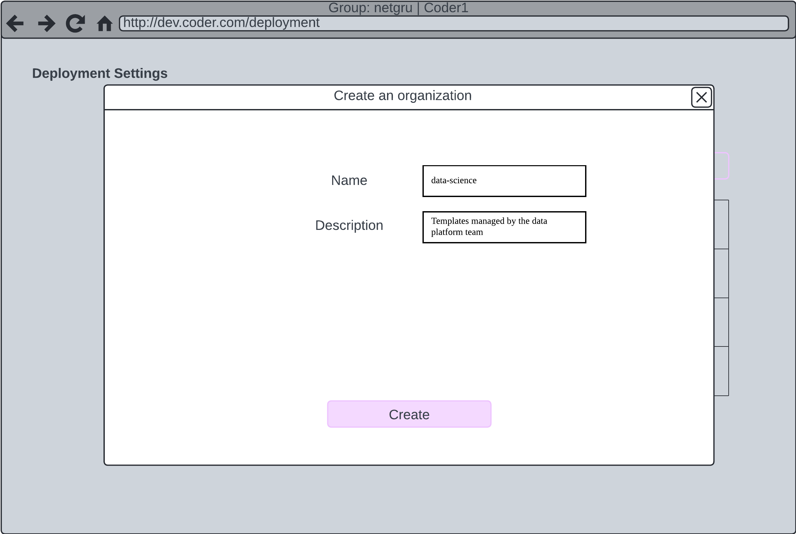
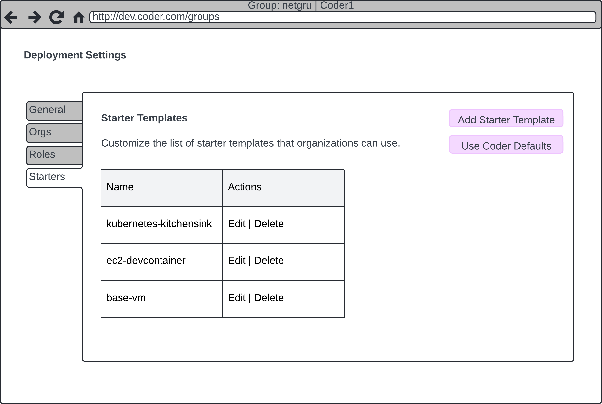

# Bring your own cluster

Allow different teams to bring their own Kubernetes cluster into Coder, or optionally build their own templates on entirely different infrastructure.

## Before you start

First, you need a Coder deployment with [tiered RBAC](../README.md) enabled. You also must have the `Global Administrator` role.

## Isolated Organizations

To give teams full autonomy of their Coder usage, templates, and infrastructure, consider giving them an isolated organization.

First, create an organization:

<div class="tabs">

## UI

Visit your deployment settings page: `https://coder.example.com/deployment/organizations`



## CLI

```sh
coder organization create \
  --name data-science \
  --description "Templates managed by the data platform team"
```

## HCL

```hcl
provider "coderd" {}

resource "coderd_organization" {
  name        = "data-science"
  description = "Templates managed by the data platform team"
}
```

</div>

While template management is the responsibility of this new organization, you can optionally provide a set of starter templates that are tailored to them, outside of the Coder defaults:



The best way to give users access to this group is via claims identity provider claims:

<div class="tabs">

> Note: Managing group and role sync via server config is deprecated and does not support multiple organizations.

## CLI

<!-- TODO -->

## UI

<!-- TODO -->

## HCL

The following HCL maps people with the `ds-user` group claim to the `Everyone` group in the `data-science` organization:

```hcl
provider "coderd" {}

data "coder_organization" "data_science" {
  name = "data-science"
}

# Add users to the data science group
resource "coderd_idp_mapping" "data_science_members" {
  claim_name = "groups"
  claim_value_includes = "ds-user"
  organization_id = data.coder_organization.data_science.id
  group_id = data.coder_organization.data_science.default_group_id
  role_id = data.coder_organization.data_science.member_role_id
}

# Add admins to the data science group
resource "coderd_idp_mapping" "data_science_admins" {
  claim_name = "groups"
  claim_value_includes = "ds-admin"
  organization_id = data.coder_organization.data_science.id
  group_id = data.coder_organization.data_science.default_group_id
  role_id = data.coder_organization.data_science.admin_role_id
}
```

</div>

Now, users can log in and gain access to the data science organization. Users with the `ds-admin` group in their identity provider will be able to manage provisioners, templates, and users within the organization.
